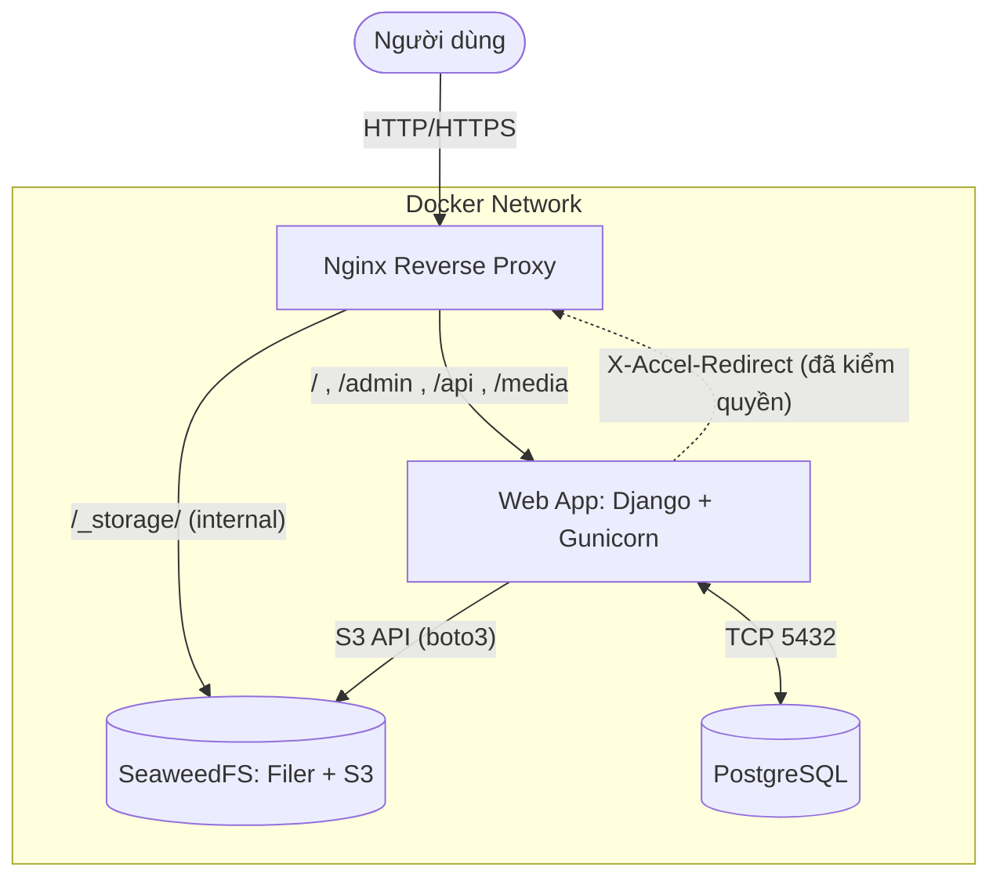
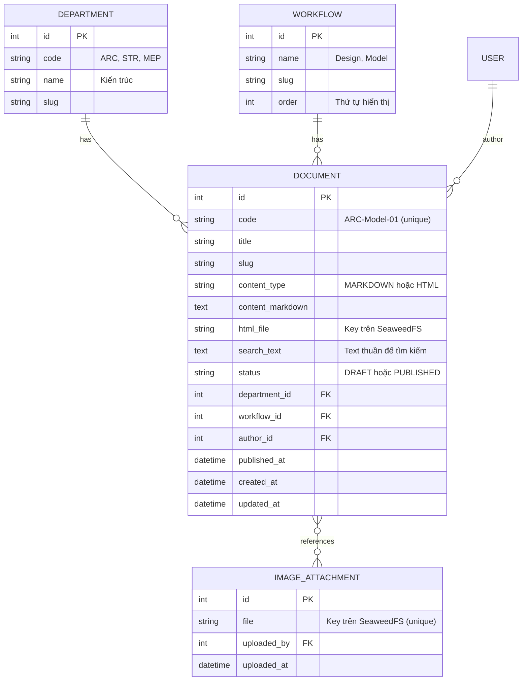
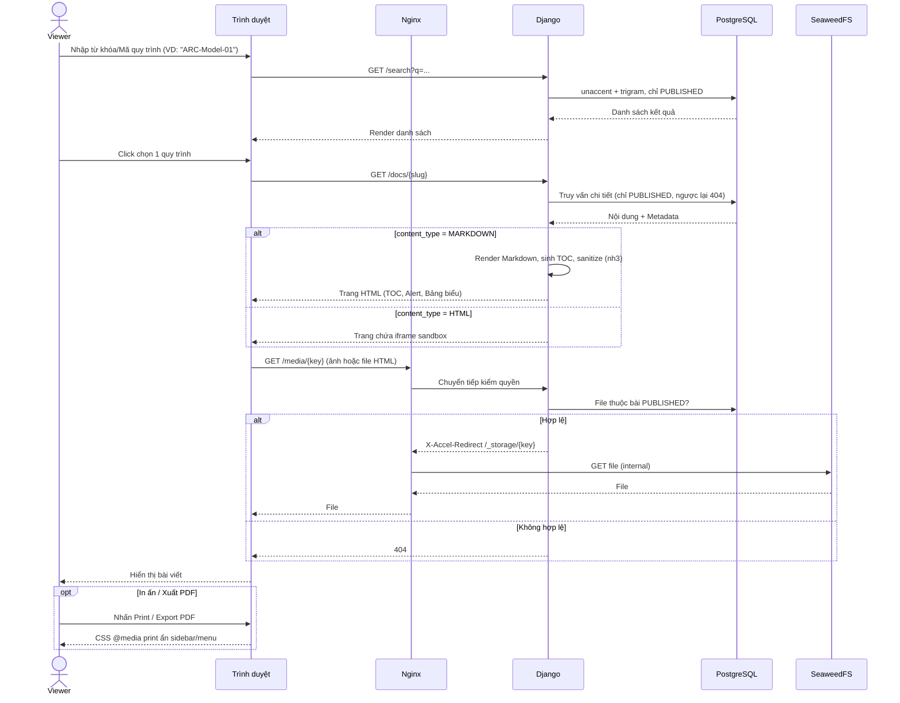
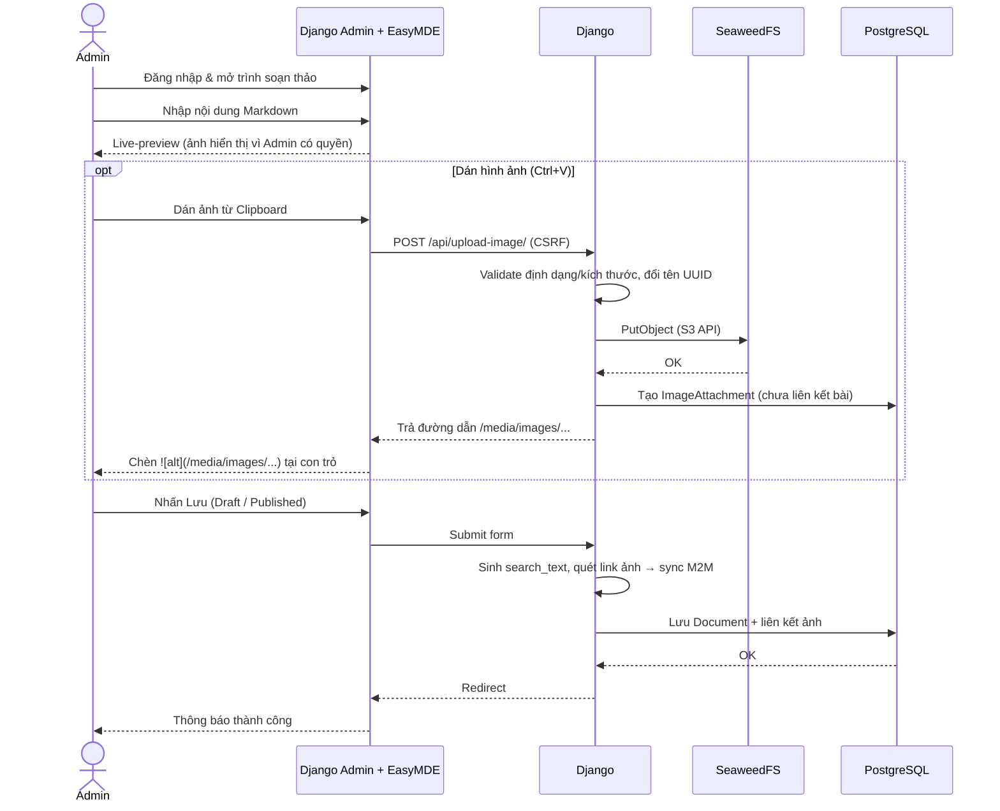
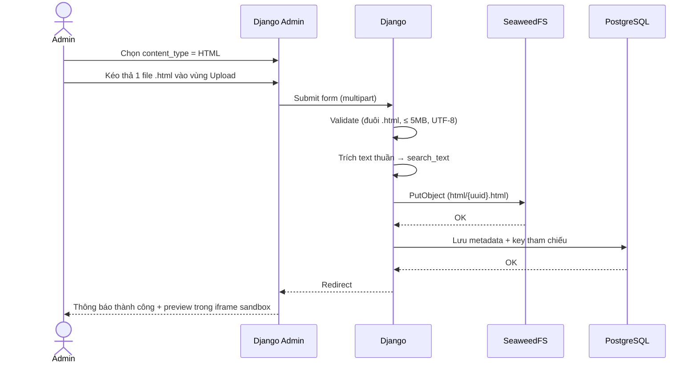

# Kế hoạch & Kiến trúc Hệ thống BIM Lab Workflow (v3)

> **Stack chốt:** Django (Monolith) · PostgreSQL · SeaweedFS (S3) · Nginx · Docker Compose · Tailwind CSS
>
> **Quyết định đã chốt**
> - Viewer **không cần đăng nhập**, chỉ thấy bài `PUBLISHED`. Bài Draft **ẩn hoàn toàn**, kể cả ảnh và file HTML đi kèm.
> - Chỉ **1 vai trò quản trị: Admin** (Django `is_staff`), không tách Editor.
> - Upload HTML: **chỉ nhận 1 file `.html` độc lập** (ảnh base64 / CSS inline). Không hỗ trợ `.zip`.

---

## 1. Kiến trúc Tổng thể



| Route | Đích | Ghi chú |
|---|---|---|
| `/` , `/docs/...` , `/search` | Django | Giao diện Viewer (public, chỉ bài PUBLISHED) |
| `/admin/` , `/api/upload-image/` | Django | Bắt buộc đăng nhập Admin + CSRF |
| `/media/<key>` | Django → kiểm quyền | Hợp lệ → trả header `X-Accel-Redirect: /_storage/<key>`. Không hợp lệ → `404` |
| `/_storage/` | SeaweedFS Filer | Location `internal` — trình duyệt **không gọi trực tiếp được** |
| `/static/...` | Django (WhiteNoise) | CSS/JS đã build |

**Cơ chế kiểm quyền file (`/media/`)**
1. Django tra key file trong DB (`IMAGE_ATTACHMENT` hoặc `DOCUMENT.html_file`).
2. Cho phép nếu: người xem là Admin đăng nhập **hoặc** file thuộc ít nhất 1 bài `PUBLISHED`.
3. Ngược lại trả `404` (không trả `403` để không lộ sự tồn tại của file).
4. Nginx nhận `X-Accel-Redirect` → tự stream file từ SeaweedFS. Django không phải đọc file, chỉ tốn 1 query.

---

## 2. Database Schema



**Quy tắc dữ liệu**
- `code` unique; gợi ý auto-fill `{department.code}-{workflow.name}-{số thứ tự}` (Admin vẫn sửa được).
- Quan hệ ảnh–bài là **many-to-many**: khi lưu bài, hệ thống quét `content_markdown` tìm các link `/media/images/...` và đồng bộ lại danh sách ảnh liên kết. Một ảnh dùng ở nhiều bài vẫn kiểm quyền đúng.
- Ảnh vừa paste nhưng bài chưa lưu → chưa liên kết bài nào → **chỉ Admin xem được**.
- `search_text` tự sinh khi lưu (Markdown → strip ký hiệu; HTML → trích text).
- Mọi query phía Viewer đi qua 1 manager duy nhất `Document.published` để tránh lọt bài Draft.
- Link ảnh trong Markdown lưu **đường dẫn tương đối** `/media/images/...`.

---

## 3. Thành phần & Công nghệ

### 3.1. `web` — Django (Backend + Frontend)
| Hạng mục | Công nghệ |
|---|---|
| Core | Python 3.12, Django 5.x, Gunicorn |
| Storage | `django-storages` + `boto3` → SeaweedFS S3 endpoint |
| Markdown | `markdown` + `toc`, `tables`, `fenced_code`, `attr_list` + extension Alert `> [!NOTE]` |
| Sanitize | `nh3` (lọc output Markdown) |
| Editor (Admin) | EasyMDE (file local, không CDN) + JS bắt sự kiện paste |
| UI Viewer | Django Templates + **Tailwind CSS** (build bằng Tailwind Standalone CLI trong Dockerfile multi-stage, không cần Node.js) |
| Static | WhiteNoise |
| Phân quyền | 1 vai trò Admin (`is_staff`). Viewer ẩn danh |

### 3.2. `db` — PostgreSQL 16 (alpine)
- Extensions `unaccent` + `pg_trgm` → tìm có dấu/không dấu, chịu gõ sai nhẹ.
- GIN index trên `search_text`, `title`, `code`.

### 3.3. `seaweedfs` — Object Storage
- Mode all-in-one: `weed server -s3` (master + volume + filer + S3 gateway).
- Bucket `bimlab-media`:
  - `images/YYYY/MM/<uuid>.<ext>`
  - `html/<uuid>.html`
- Credential S3 qua `s3.json` (mount), giá trị từ `.env`. Bucket **private**.
- Bucket tạo tự động bằng management command `init_storage` (idempotent) khi `web` khởi động.
- Pin version image cụ thể, không dùng `latest`. Không publish port ra host.

### 3.4. `nginx`
- `client_max_body_size 20m`.
- `/media/` → Django. `/_storage/` là location `internal`, proxy tới SeaweedFS Filer, chỉ `GET/HEAD`.
- File `.html` trả qua `/_storage/` được gắn `Content-Security-Policy: sandbox allow-scripts` + `X-Content-Type-Options: nosniff`.
- Cache: file của bài PUBLISHED trả `Cache-Control: public, max-age=3600`. Phản hồi cho Admin xem Draft trả `private, no-store`.

---

## 4. Bảo mật

| Rủi ro | Biện pháp |
|---|---|
| Lộ bài Draft (nội dung, ảnh, file HTML) | Viewer query qua `Document.published`; file đi qua kiểm quyền `/media/` + `X-Accel-Redirect`; storage private, không có đường truy cập trực tiếp |
| Đoán URL file | Key UUID + trả `404` thống nhất cho mọi trường hợp không có quyền |
| HTML upload chứa JS độc hại | `<iframe sandbox="allow-scripts">` **không** `allow-same-origin` + header CSP sandbox; validate `.html`, ≤ 5MB, UTF-8 |
| Markdown chứa HTML thô | Output qua `nh3` với allowlist |
| Upload ảnh tùy ý | Login + CSRF; chỉ `png/jpg/gif/webp`, ≤ 10MB, verify bằng Pillow, đổi tên UUID |
| Ghi/xóa trái phép storage | S3 credential chỉ nằm trong `web`; Nginx chỉ GET; SeaweedFS không publish port |
| Bài đổi PUBLISHED → DRAFT nhưng ảnh còn trong cache trình duyệt | `max-age` ngắn (1h) — **chấp nhận** |
| Secrets | `.env` không commit; `DEBUG=False`, `ALLOWED_HOSTS`, `CSRF_TRUSTED_ORIGINS` theo môi trường |

**Giới hạn cố định:** chỉ hỗ trợ HTML 1 file. File phụ thuộc tài nguyên ngoài (VD: Word export kèm thư mục `_files`) sẽ vỡ ảnh → Admin cần xuất dạng "Single File Web Page" hoặc chuyển sang Markdown.

---

## 5. Cấu trúc Source Code

```text
BIMLab_Workflow/
├── docker-compose.yml          # Production-like
├── docker-compose.dev.yml      # Override dev (runserver, mount code, DEBUG)
├── .env.example                # Mẫu biến môi trường (commit)
├── .env                        # Thật (KHÔNG commit)
├── nginx/
│   └── default.conf
├── seaweedfs/
│   └── s3.json.template
├── web/
│   ├── Dockerfile              # Multi-stage: build Tailwind → Python runtime
│   ├── requirements.txt
│   ├── manage.py
│   ├── config/                 # settings (base/dev/prod), urls, wsgi
│   ├── docs/                   # App chính
│   │   ├── models.py           # + PublishedManager
│   │   ├── admin.py
│   │   ├── views.py            # Viewer + media_access (X-Accel)
│   │   ├── markdown_ext/       # Alert extension, cấu hình TOC
│   │   ├── services/           # render_markdown, sanitize, extract_text, sync_images
│   │   └── management/commands/
│   │       ├── init_storage.py
│   │       └── cleanup_orphans.py
│   ├── templates/
│   ├── static/
│   │   ├── src/input.css
│   │   └── vendor/easymde/
│   └── tailwind.config.js
├── scripts/
│   └── backup.sh
└── data/                       # gitignore
    ├── postgres/
    └── seaweedfs/
```

**Docker Compose — điểm chính**
- `depends_on` + `healthcheck` cho `db`, `seaweedfs`.
- Chỉ `nginx` publish port (80/443).
- `restart: unless-stopped`.

---

## 6. Vận hành

| Hạng mục | Cách làm |
|---|---|
| Backup | `backup.sh` chạy cron hằng ngày: `pg_dump` + nén `./data/seaweedfs`, giữ 7 bản |
| Dọn ảnh rác | `cleanup_orphans` hằng tuần: xóa ảnh không liên kết bài nào và cũ hơn 7 ngày |
| Log | Gunicorn + Nginx → stdout → `docker compose logs` |
| Restore | Hướng dẫn trong `README.md`, test restore ít nhất 1 lần trước go-live |

---

## 7. Lộ trình Triển khai — `[ESTIMATE]` 7 ngày

| Ngày | Nội dung | Kết quả kiểm chứng |
|---|---|---|
| 1 | Docker Compose 4 service, healthcheck, `.env`, SeaweedFS S3 + `init_storage`, Nginx `internal` location | `docker compose up` xanh; upload/đọc file test qua boto3; gọi thẳng `/_storage/` bị chặn |
| 2 | Models (M2M ảnh), migrations, `PublishedManager`, Django Admin, extension `unaccent`/`pg_trgm` | Tạo Department/Workflow/Document trong Admin |
| 3 | EasyMDE + API paste ảnh, `sync_images` khi lưu bài, view `media_access` + X-Accel | Ảnh bài Draft: Admin xem được, tab ẩn danh nhận 404 |
| 4 | Upload HTML: validate, lưu storage, trích `search_text`, preview iframe sandbox | File HTML có `<script>` không đọc được cookie site |
| 5 | Viewer UI (Tailwind): trang chủ, lọc Bộ môn/Flow, tìm kiếm | Tìm "thiet ke" ra bài "Thiết kế"; bài Draft không xuất hiện |
| 6 | Trang chi tiết: Markdown + TOC + Alert + Table, sanitize, CSS print | Ctrl+P không còn sidebar/menu |
| 7 | Backup/cleanup, header bảo mật Nginx, README, test tổng | Checklist go-live pass |

---

## 8. Luồng Hoạt động (Sequence Diagrams)

### 8.1. Luồng Người đọc (Viewer — không đăng nhập)



### 8.2. Luồng Quản trị — Soạn thảo Markdown & Paste ảnh



### 8.3. Luồng Quản trị — Tải lên file HTML



---

## 9. Ngoài phạm vi (Backlog)
- Lịch sử phiên bản bài viết (`django-simple-history`).
- Viewer đăng nhập / phân quyền đọc theo bộ môn.
- HTTPS tự động (Let's Encrypt) — tùy hạ tầng server nội bộ.

## 10. Điểm cần kiểm chứng khi code
- `[UNVERIFIED]` Cú pháp `s3.json` của SeaweedFS và việc Nginx proxy `/_storage/` tới Filer theo đường dẫn bucket → xác minh Ngày 1.
- `[UNVERIFIED]` Có extension sẵn cho GitHub-style Alert trong Python-Markdown không; nếu không, tự viết (~30 dòng).
